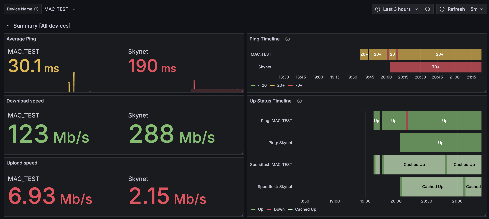
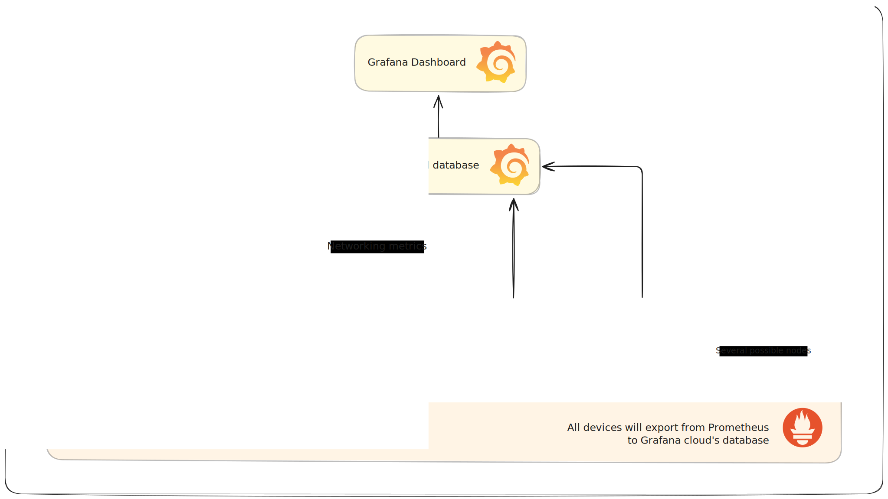

# NetCheck




> A screenshot of the summary section of the Grafana dashboard with 2 devices reporting



> A flowchart of systems used in a NetCheck setup


NetCheck is a persistent network uptime and speed-logging Grafana exporter intended for use on multiple Raspberry Pis. The intended audience of this software is IT professionals with at least a little experience with setting up and debugging CLI-based software.

Forked from [MiguelNdeCarvalho/speedtest-exporter](https://github.com/MiguelNdeCarvalho/speedtest-exporter)


## What is this and should I use this?

This software logs network information in different physical locations to help troubleshoot AP/switch-level outages. It's a one-time setup that does not integrate with any existing IT systems.

**Key Features:**

- Interactive network monitoring with Grafana
- Metric collection with isolation from existing infrastructure
- Hassle-Free Deployment
- Find issues in your network like how all end users inevitably do
- Free cloud-based metric storage and retrieval

---


This software was originally commissioned by an organisation with hundreds of access points to maintain, but no specialised ping plotting systems, no access to networking configuration and no on-site technicians to diagnose or confirm troublesome areas. The building occupants in this organisation's premises would occasionally have reports of intermittent WiFi drops and latency issues, but a technician was not always available to manually confirm these issues. And when they were, the issue would sometimes take long periods to occur. These issues are occasionally things like faulty APs, bandwidth caps, etc. However, some issues would resolve themselves over time or were issues with the user's device and not the IT infrastructure. 

Therefore, an optimal solution to help the IT staff was to leave a device (Raspberry Pi) in the suspected area and monitor the network to find issues. This method works well in this situation because:

- **The software will start automatically in between boots**.
    - Meaning that after setup, you can just unplug the device, move it to where you want to monitor and let it run without having to even log in to the device 
- **Isolation from existing infrastructure - emulation of the endpoint device**.
    - Having a machine physically move around dedicated to monitoring and having it connected by WiFi means that it's in a position to detect issues similarly to how a user would. It can experience bandwidth limiting from an AP, low signal strength and various other radio and AP-related issues, unlike any monitoring software that resides in the server rack or configured with the AP itself. 
        - However, this does include drawbacks. As it is so isolated, you're unable to see metrics such as number of devices connected, networking rules or anything higher level. If this is an issue for your diagnosis, you could implement both systems in parallel anyway.
- **Cloud-based reporting**
    - All metrics are sent to Grafana Cloud. So if a device does go down, or your entire network is faulty. Any other stable internet connection can load into the Grafana dashboard and see what's happened
- **Control variables**
    - If you have a device running this software in a spot that is known to be good, you can compare it with other devices in more troublesome areas on the Grafana dashboard.


In essence, if you're looking to monitor endpoint network information in areas of a building with complete isolation from existing infrastructure, this may be helpful.

## Instructions

### OS and Prerequisites 

| OS | Compatability |
| --- | :-: |
| Linux Mint 21 | 🟩 |
| MacOS | 🟩 |
| 64 bit raspiOS lite | 🟩 |
| Anything that runs Docker | Probably |

Developed and tested for *Raspberry Pi 4b*. May work on other Linux devices, not sure.
I developed this on an arm-based Mac and it also works fine. If you can run Docker you're probably fine.

- Software
    - [Install `docker / docker compose`](https://docs.docker.com/compose/install/) if you haven't got it already. **If using raspberry pi** follow [these official instructions](https://docs.docker.com/engine/install/debian/) and skip the Docker Desktop instruction just below
    - If you are using **Docker Desktop**, make sure `Docker-Desktop` is set to automatically open as a startup app if you plan to have this run automatically. I mean the entire app as well, not just the engine and container services. 


### Setup

> [!TIP]
> An optimal setup for Raspberry Pi would be to set up an automatic WiFi connection which can be done with `$ sudo nmtui` over CLI. This way you can plug and play. Alternatively, you can technically run this in wired mode if you don't care about monitoring APs.

#### Grafana Setup

1. Create a GrafanaCloud dashboard with [`Dashboard/Speedtest-Exporter.json`](https://github.com/Sandwich1699975/NetCheck/blob/main/Dashboard/Speedtest-Exporter.json)

2. Create a Prometheus account

#### Client Setup

Check you have the device prerequisites listed above.

1. Clone the repository

```terminal
git clone https://github.com/Sandwich1699975/NetCheck.git
cd NetCheck
git submodule init
git submodule update
```

2. Run the one-time setup script to generate the `.env` file

```terminal
bash setup.sh
```

3. Add your details into `.env`

```terminal 
nano .env
```

4. Then run Docker compose from the project root in detached mode. 

```terminal
sudo docker compose up -d --build
```

> [!NOTE]
> Every time you add or turn on/off a device, you need to refresh the Grafana page for it to appear in the variable field at the top


## `localhost` References

Where to access local servers when setup (can differ)

- [Prometheus (`http://localhost:9090`)](http://localhost:9090)
- [Speedtest Exporter (`http://localhost:9798`)](http://localhost:9798)


## Troubleshooting

### `.env not found` or `.env: no such file`

```
env file /home/username/NetCheck/.env not found: stat /home/username/NetCheck/.env: no such file or directory
```

Run `bash setup.sh` to generate `.env` file.

---

### `failed to solve: failed to read dockerfile:`

```
[+] Building 0.3s (4/4) FINISHED                                                   docker:default
 => [netcheck-exporter internal] load build definition from Dockerfile                       0.1s
 => => transferring dockerfile: 2B                                                           0.0s
 => [prometheus internal] load build definition from Dockerfile                              0.1s
 => => transferring dockerfile: 780B                                                         0.0s
 => CANCELED [prometheus internal] load metadata for docker.io/prom/prometheus:latest        0.1s
 => CANCELED [prometheus internal] load metadata for docker.io/library/python:3.9-slim       0.1s
failed to solve: failed to read dockerfile: open Dockerfile: no such file or directory
```

You probably forgot to initialise the git submodules. Run:

```terminal
git submodule init
git submodule update
```